# Hardware
## Bottom middle assemblyhttps://github.com/RolandRust/HonigSchleppElesl/blob/main/Hardware/README.md
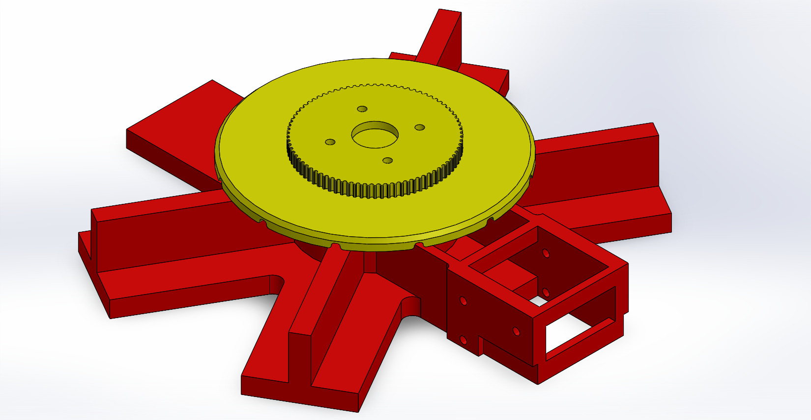
### Bottom_Middle
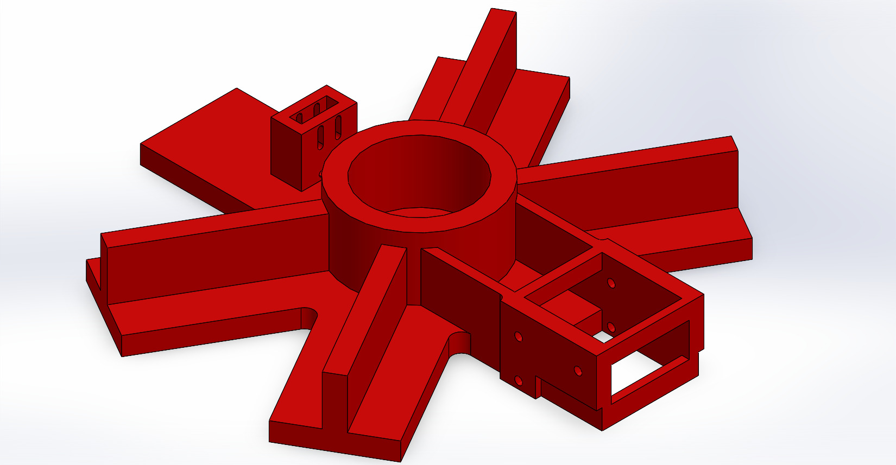
### Mittelteil_Drehelement
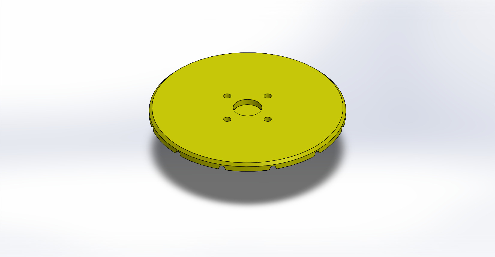
### HTD3_80_6.5
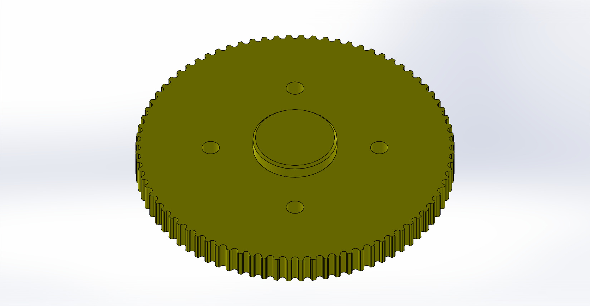

## 	Roll holder assembly
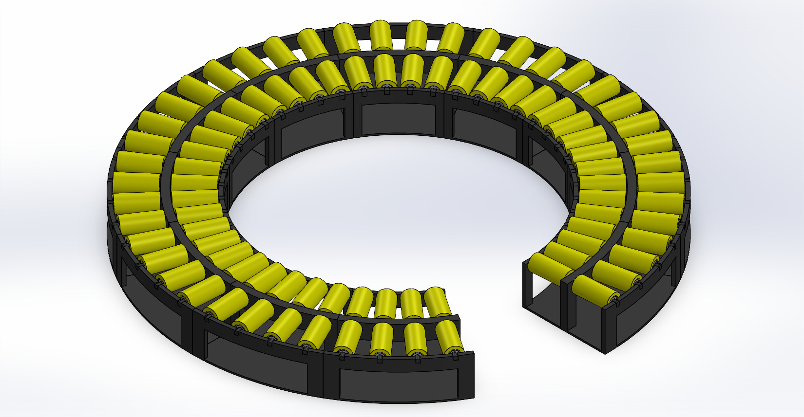
### Rollenhalter_klein
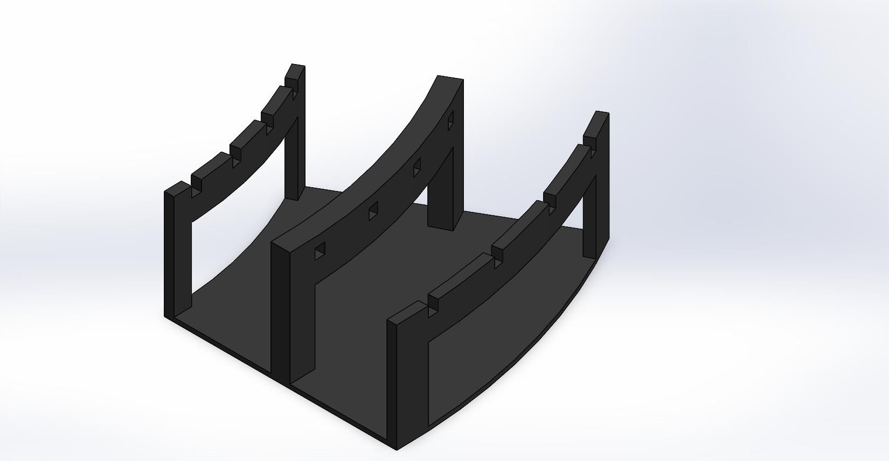
### Rolle
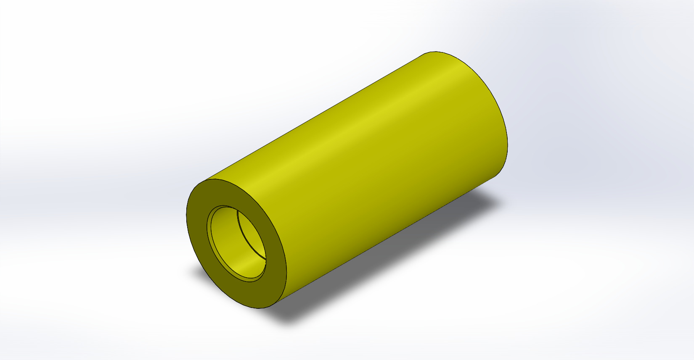
### Zylinder_Stift

## 	Bottom top assembly
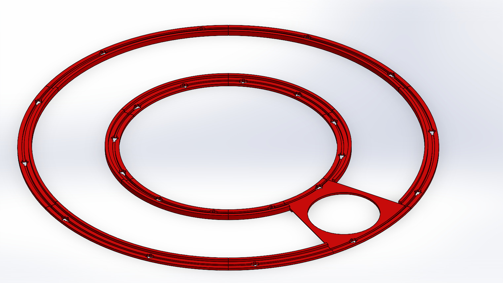
### Top_Scale
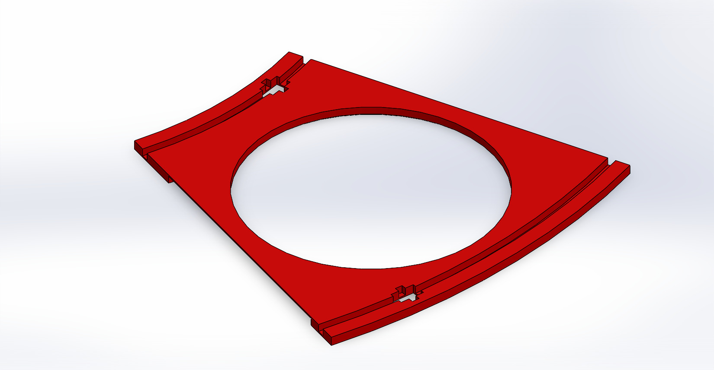
### Top_Ring_Big_Inside
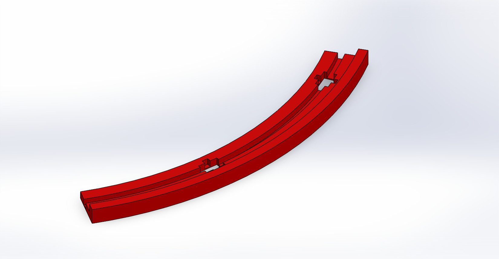
### Top_Ring_Big_Outer
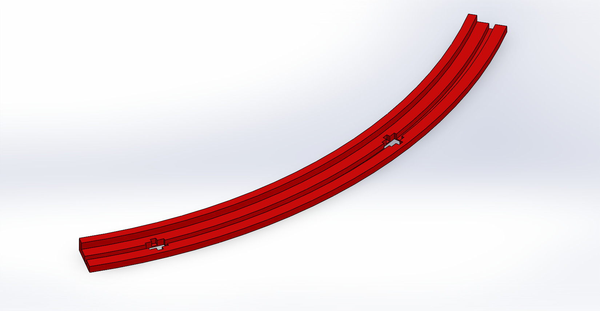
### Top_Ring_Smal_Inside
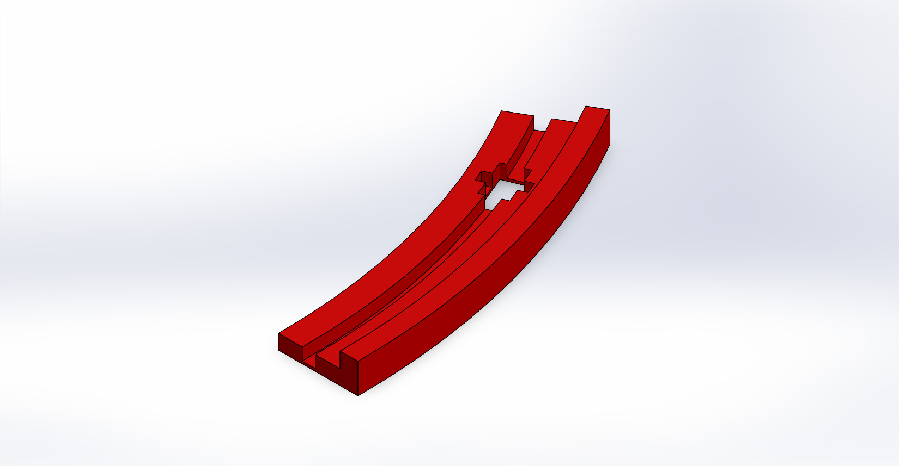
### Top_Ring_Small_Outer
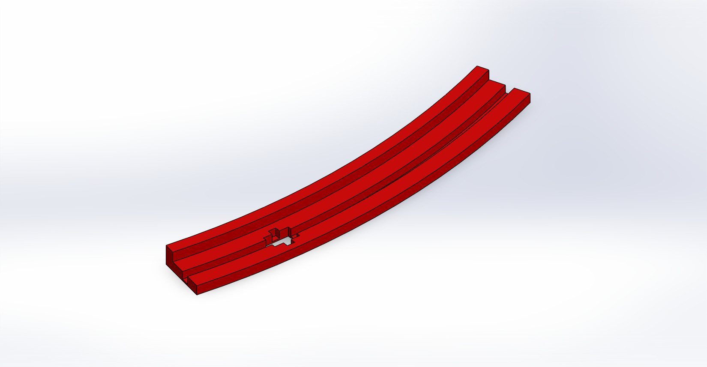

## 	Wall inside assembly
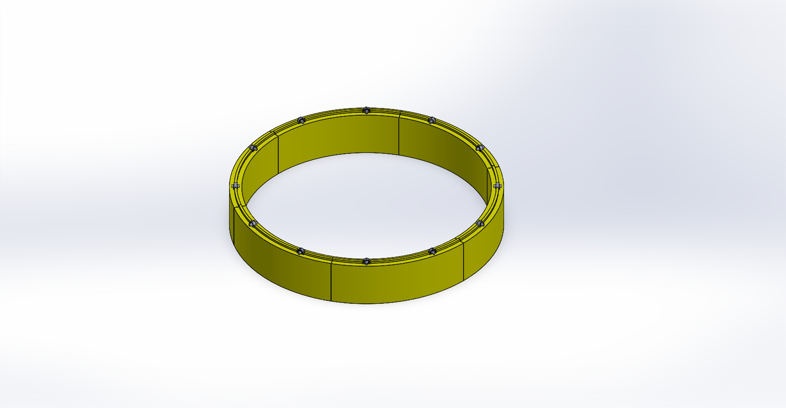
### Wall_Inside
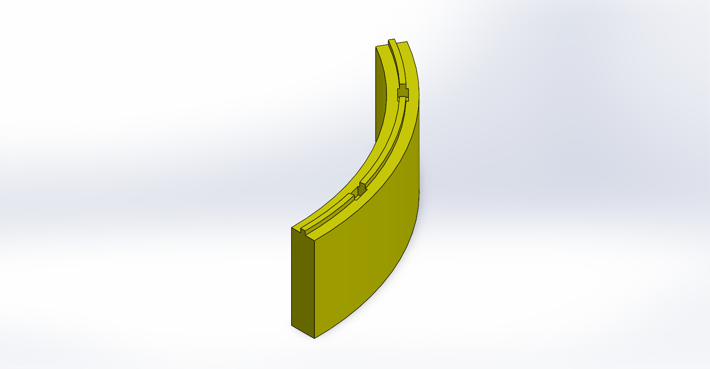

## 	Wall outside assembly
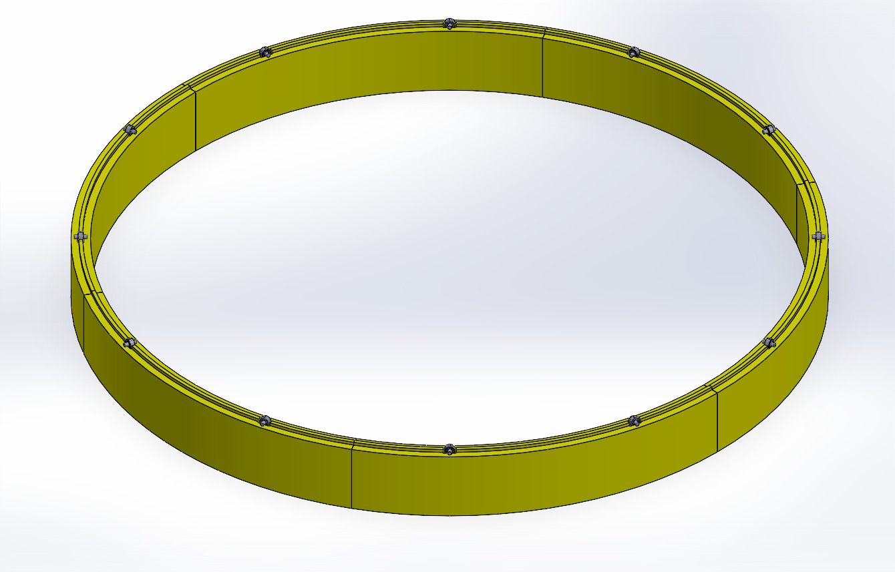
### Wall_Inside

